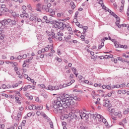
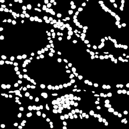
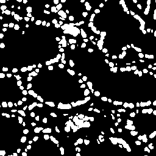
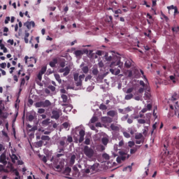
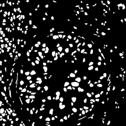
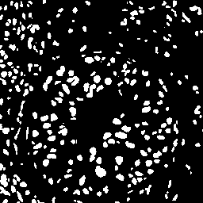
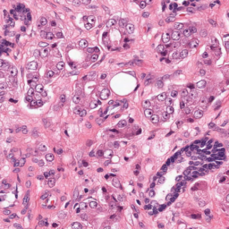
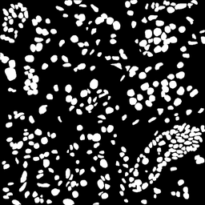
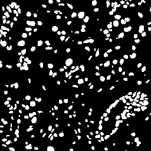

## What is DiffSeg-MoNuSeg?

DiffSeg-MoNuSeg is an implementation of SegDiff research paper which uses the conditional Denoising Diffusion Probabilistic Model (DDPM) for semantic segmentation tasks. The model combines a feature extraction network for input images with a diffusion-based denoising process conditioned on segmentation features to generate high-quality segmentation masks.

<table>
  <tr>
    <th>Input</th>
    <th>Ground Truth Mask</th>
    <th>Predicted Mask</th>
  </tr>

  <tr>
    <td></td>
    <td></td>
    <td></td>
  </tr>

  <tr>
    <td></td>
    <td></td>
    <td></td>
  </tr>

  <tr>
    <td></td>
    <td></td>
    <td></td>
  </tr>
</table>


The architecture consists of:
- **Input Encoder**: RRDBNetSimple (Residual-in-Residual Dense Block Network) for extracting features from input images
- **Segmentation Feature Extractor**: Simple convolutional network for processing noisy segmentation masks
- **Conditional U-Net**: Diffusion model backbone with time embeddings and attention mechanisms for denoising

## Key Features

- **Diffusion-based Segmentation**: Leverages DDPM for generating segmentation masks through iterative denoising
- **Conditional Generation**: Uses both image features and segmentation priors for guided mask generation
- **Patch-based Training**: Efficient training on large images using overlapping patches
- **Sliding Window Inference**: Supports arbitrary-sized images through patch-based inference
- **Medical Imaging Focus**: Optimized for nuclei segmentation in histopathology images

## Installation

### Prerequisites

- Python 3.7+
- CUDA-compatible GPU (recommended for training)

### Dependencies

Install the required packages:

```bash
pip install torch torchvision pillow numpy tqdm
```

For GPU support, install PyTorch with CUDA:

```bash
pip install torch torchvision torchaudio --index-url https://download.pytorch.org/whl/cu118
```

## Dataset Preparation

Download the MoNuSeg dataset and organize it as follows:

```
MonuSeg/
├── Train/
│   ├── images/
│   └── masks/
└── Test/
    ├── images/
    └── masks/
```

Place the `MonuSeg` folder in the project root directory.

## Usage

### Training

To train the model:

```bash
python train.py
```

The training script will:
- Load patches from `MonuSeg/Train/`
- Train the diffusion model for 300 epochs
- Save checkpoints in the `checkpoints/` directory
- Resume from the latest checkpoint if available

### Evaluation

To evaluate the trained model on the test set:

```bash
python metrics.py
```

This will compute and display:
- IoU (Intersection over Union)
- Dice coefficient
- Precision
- Recall
- Accuracy

### Inference on Single Images

To generate segmentation masks for individual images:

```bash
python test.py
```

Update the `INPUT_IMAGE` and `OUTPUT_PATH` variables in `test.py` for your specific use case.

## Model Architecture Details

### ConditionalUNet
- Time-embedded denoising U-Net with residual blocks
- Self-attention mechanisms in deeper layers
- Supports conditioning on external features

### RRDBNetSimple
- Lightweight feature extractor based on DenseNet architecture
- Residual-in-Residual connections for improved gradient flow
- Extracts 32-channel feature maps from RGB images

### SegModel
- Simple convolutional feature extractor for segmentation masks
- Processes noisy masks during the diffusion process

## Configuration

Key hyperparameters can be modified in the respective scripts:

- `NUM_TIMESTEPS`: Number of diffusion steps (default: 1000)
- `PATCH_SIZE`: Training patch size (default: 64)
- `STRIDE`: Patch overlap stride (default: 32)
- `THRESHOLD`: Binarization threshold for inference (default: 0.7)
- `N_RUNS`: Number of times to run the inference to reduce the sampling variance (default: 1)
